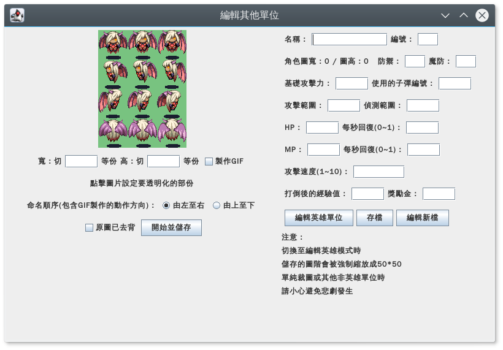

# 單位編輯器

將人物動作分割圖拖到左方區域可以去背以及合成 gif

主程式：CreepEditor.jar

圖片會在 `Move` 資料夾存放 gif，在 `Stay` 資料夾存放切割的圖，在 `SaveData` 存放人物資訊。

## 注意事項

`GIFEncoder.java`、`GifDecoder.java`、`GifUtil.java` 為網路找來的程式碼，非本人編寫。

## License

BSD
